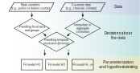

## Welcome {.smaller}

This short deck introduces the `multinomialTS` package and the state-space
approach for testing hypotheses about environmental drivers and biotic
interactions in ecological and paleoecological time series.

- Multinomial state variables ($Y$) — e.g., pollen counts
- Environmental covariates ($X$) — e.g., charcoal accumulation, fire events
- Estimate taxa interactions **and** driver–taxa relationships

## The problem {.smaller}

Relative-abundance data (counts from a finite sample across classes) create
interdependencies among taxa: we can only estimate $n-1$ taxa.

If 3 species and 60% are species 1, 30% are species 2, then species 3 must be 10%.

`multinomialTS` is designed for a multinomially distributed response, with
covariates of mixed types.

## Two decision streams {.smaller}

The data are split into:

1. Handling the state variables ($Y$, e.g., pollen counts)
2. Handling the covariates ($X$, e.g., charcoal accumulation rates)

{#fig-flow}

## What you get out {.smaller}

Unlike ordination or cluster analysis, this state-space approach estimates:

- **Coefficients for taxa interactions**
- **Driver–taxa relationships**

We recommend it as complementary to other methods — each has its advantages.

## Demo {.smaller}

```{r}
#| label: demo-placeholder
#| eval: false
library(multinomialTS)
# walk through the fit here during the demo
```

Full walkthrough: `state-space-walkthrough.qmd`

## Thanks! {.smaller}

Questions?

- Package: <https://github.com/QuinnAsena/multinomialTS>
- Workshop: <https://github.com/QuinnAsena/multinomialTS-workshop-MEE>
