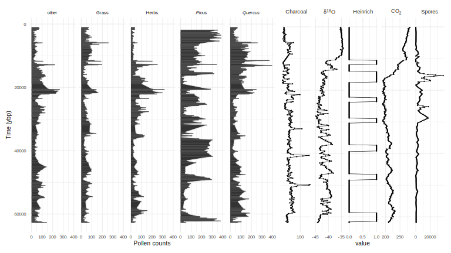
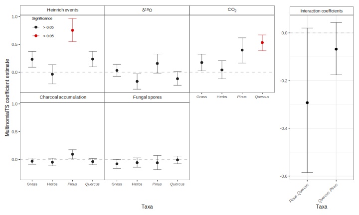
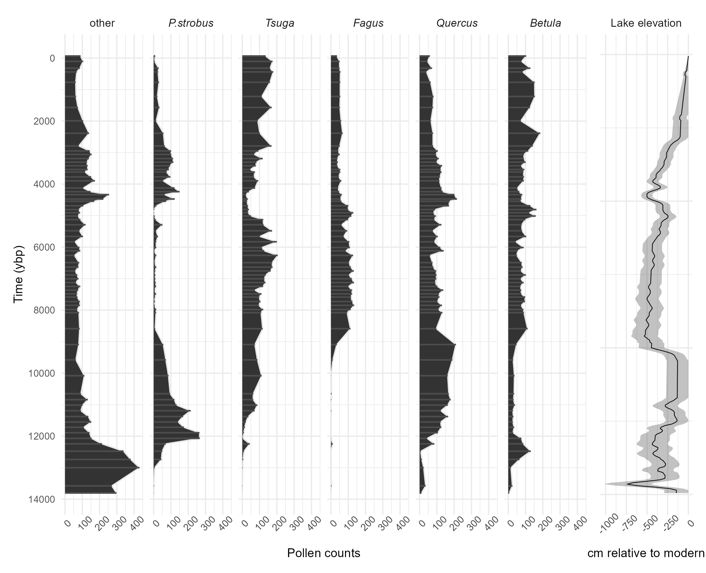
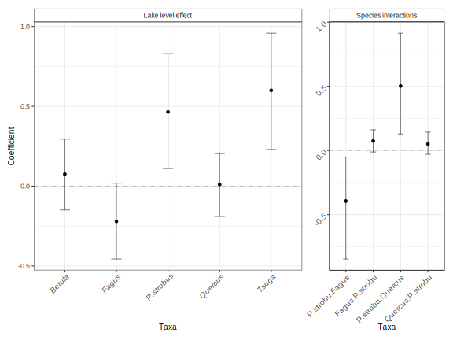

## Welcome {.smaller}

Here we going to demonstrate the `multinomialTS` r package on two contrasting palaeoecological datasets.

This will be followed by a demo coding session...

## People {.smaller}

:::: {.columns}
::: {.column}
- Jack Williams
- Tony Ives
- Angie Perotti
- Nora Schlenker
:::
::: {.column}
- David Nelson
- Bryan Schuman
- Jonathan Johnson
- Vania Stefanova
:::
::::

  

## The problem {.smaller}

Relative-abundance data (counts from a finite sample across classes) create
interdependencies among taxa: we can only estimate $n-1$ taxa.

If 3 species and 60% are species 1, 30% are species 2, then species 3 must be 10%.

`multinomialTS` is designed for a multinomially distributed response, with
covariates of mixed types.

## State-space modelling {.smaller}

_State-space modelling goes beyond descriptive approaches and attempts to estimate:_

 

- Autoregressive / density dependent processes 
- Interspecific interactions
- taxa-driver relationships
- Combinations of the above

## State-space modelling {.smaller}

State-space modelling attempts to predict the "true" unobservable state of a system from observable variables. It does so via two equations:

 
Process equation:

$$
Z_t = B0 + C(Z_{t-1} - (B0 - BX_{t-1})) + BX_t + E_t
$$

$$
E_t \sim N(0, \sigma^2V)
$$

Observation equation:

$$
Y_t = Multinomial(P_t, d)
$$

$$
logit(P_t) = Z_t
$$

## multinomialTS {.smaller}

- Models a multinomial distribution (i.e., count data) directly
- Accepts multiple covariates of different type
- Incorporates  process error _and_ observation error
- [Asena _et al.,_ 2026](https://besjournals.onlinelibrary.wiley.com/doi/10.1111/2041-210x.70315)

## Fitting process {.smaller}

Two case studies to demonstrate the decision process and fitting process of `multinomialTS`

- Decisions about the data
  - chosing focal taxa and reference group
  - choosing window-span/prediction resolution

- Decisions about the model
  - set up multiple working hypotheses
  - fit model to hypotheses or components of each hypothesis

## Case studies {.smaller}

:::: {.columns}
::: {.column}
#### Lake Tulane

- Florida, USA
- ~60,000 year-long record
- Covariates
  - fungal spores (proxy for megaherbivory)
  - $CO_2$ and $\delta18O$ (climate)
  - Heinrich events (climate-related)
  - charcoal (fire)
- Williams _et al.,_ in review, @grimm1993; @grimm2006b
:::
::: {.column}

#### Sunfish Pond

- Pennsylvania, USA
- ~13,000 years
- Covariates (local)
  - lake level (proxy for humidity)
- Johnson et al., in review, will include more covariates
:::
::::

## Lake Tulane variables {.smaller}

{fig-align="center"}

## Fitting Lake Tulane {.smaller}

:::: {.columns}
::: {.column}
#### Questions/hypotheses:

- Are biotic interactions or climatic variability the primary drivers of pine and oak dynamics?
- Is mega-herbivory a significant driver of vegetation change?
- is fire a significant driver of vegetation change?
:::

::: {.column}
#### Parameter selection:

- Window span / prediction resolution 200 years
- Species/taxonomic group selection
  - two functional groups
  - two key dominant taxa
- Interactions estimated:
  - pine - oak (in this example)
:::
::::

## Lake Tulane results {.smaller}

{fig-align="center"}

Supported hypotheses: _given the data_, taxa interactions are important but climate covariates have a stronger influence.

## Sunfish Pond variables {.smaller}

{fig-align="center"}

## Fitting Sunfish Pond {.smaller}

:::: {.columns}
::: {.column}
#### Questions/hypotheses:

- Are local climatic conditions (humidity) a stronger driver of change than taxa interactions?
:::
::: {.column}
#### Parameter selection

- Window span / prediction resolution 100 years
- Species/taxonomic group selection
  - five most dominant taxa
  - eastern white pine, hemlock, beech, oak, and birch
- Interactions:
  - pine - hemlock (in this example)
:::
::::

## Sunfish Pond results {.smaller}

{fig-align="center"}

Supported Hypotheses: local conditions most important to hemlock and pine. Interactions are important to pine-beech and pine-oak dynamics. Nothing significant at 0.05, but we do not recommend relying on P-values to test hypotheses. 

## Comparison of case-studies {.smaller}

_`multinomialTS` does not show causality but lends statistical support to hypotheses._

 

:::: {.columns}
::: {.column}
#### Lake Tulane

- Long record
- Multiple covariates
- Few dominant taxa
- Key drivers and interactions detected
- Likely a loss of fine-scale processes like post-fire recovery

:::
::: {.column}
#### Sunfish Pond

- Holocene record
- Single covariate
- Multiple key taxa
- Finer-scale resolution
- Likely to be missing explanitory power from unmeasured drivers
:::
::::

# Thank you for listening!

{fig-align="center" width=30%}

:::{.r-stack}
asenaq@caryinstitute.org
:::

::: footer

{width=55} {width=90}
:::

## References

::: {#refs}
:::
